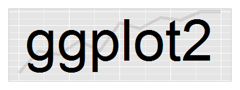

# Visualização

Por quê visualizar dados?

```{r}
library(tidyverse)
datasaurus <- read_tsv('inputs/DatasaurusDozen.tsv')
```

Medidas descritivas

```{r}
datasaurus %>%
  filter(dataset != 'v_lines') %>% 
  group_by(dataset) %>% 
  summarise(cor = cor(x, y), 
            x_mean = mean(x), y_mean = mean(y),
            x_sd = sd(x), y_sd = sd(y))
```

Gráficos de dispersão

```{r, fig.height=6, fig.width=8}
datasaurus %>% 
  filter(dataset != 'v_lines') %>% 
  ggplot(aes(x, y)) +
  geom_point() +
  facet_wrap(~dataset) +
  theme_minimal()
```

----------------------------------------------------------

# Introdução

```{r, echo=FALSE}

```

- Criado pelo Hadley Wickham
- Gramática dos gráficos (Leland Wilkinson) 
    - o que é um gráfico estatístico?


----------------------------------------------------------

> Mapeamento dos dados em atributos estéticos 
> (posição, cores, formas, tamanhos)
> de formas geométricas (pontos, linhas, barras)

- O que usamos para montar um gráfico estatístico?
    - Dados
    - Camadas -> geoms e stats
    - Escalas -> mapeamento inverso
    - Coordenadas -> por exemplo, sistema cartesiano
    - Facets -> condicionamento
    - Temas

----------------------------------------------------------

## Por que utilizar o ggplot?


```{r, echo=FALSE, fig.cap='Gráficos no R base.'}
knitr::include_graphics('inputs/Etch.jpg')
```


```{r, echo=FALSE, fig.cap='Gráficos com ggplot2.'}

```

- construção é intuitiva e organizada
- a estrutura é a mesma para todo tipo de gráfico
- os gráficos já são naturalmente mais bonitos

----------------------------------------------------------

## Ajuda

- **Documentação**: http://ggplot2.tidyverse.org/reference/
- **Cookbook**: http://www.cookbook-r.com/Graphs/
- **Cheatsheet**: https://www.rstudio.com/wp-content/uploads/2016/11/ggplot2-cheatsheet-2.1.pdf

----------------------------------------------------------

# Funcionamento do ggplot

Base gráfica

```{r}
ggplot(cars)
```

Criando grids: eixo x

```{r}
ggplot(cars, aes(x = speed))
```

Criando grids: eixos x e y

```{r}
ggplot(cars, aes(x = speed, y = dist))
```

Adicionando formas geométricas

```{r}
ggplot(cars, aes(x = speed, y = dist)) +
  geom_point()
```

----------------------------------------------------------

# `aes()` e `geom_*`

## Gráfico de barras

### Reordenando os níveis

## Histograma

### Arrumando o número de classes

### Mudando a cor

## Boxplot

## Gráfico de dispersão

### Ordenando pela mediana

----------------------------------------------------------

# Temas

## Labels

## Arrumando labels do eixo x

----------------------------------------------------------

# Facets


----------------------------------------------------------

